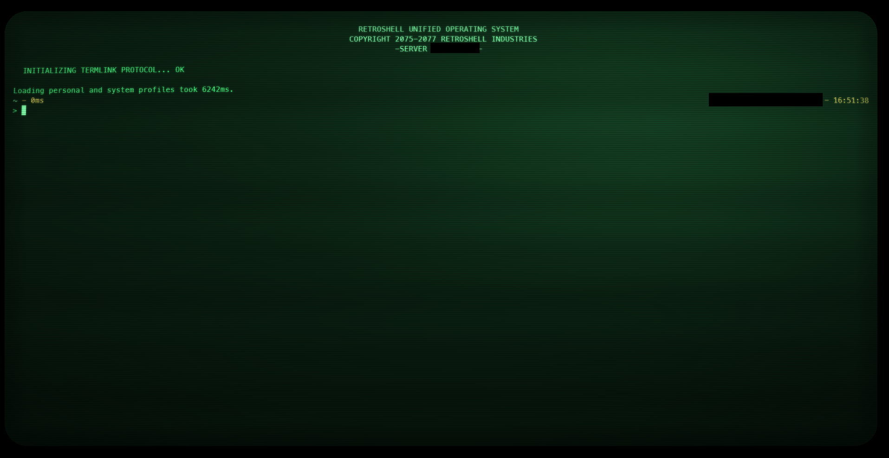

# retro-powershell

PowerShell com cara de terminal Fallout: shader CRT (curvatura de tubo, scanlines,
fósforo verde desgastado), banner de boot do **RETROSHELL UNIFIED OPERATING SYSTEM**
com som de inicialização e spinner à moda antiga, prompt oh-my-posh temático e som
de teclado mecânico **IBM Model F XT (1981)** em todo o Windows via Mechvibes.
O tubo acende antes do banner, e de vez em quando falha: o texto dá uma tremida
seca, e a cada tanto uma faixa de estática sobe devagar pela tela, como monitor
velho com mau contato.



## Requisitos

| O quê | Como instalar | Para quê |
|---|---|---|
| [oh-my-posh](https://ohmyposh.dev) | `winget install JanDeDobbeleer.OhMyPosh` | o prompt temático |
| [Mechvibes](https://mechvibes.com) | baixar e instalar pelo site (o instalador não roda silencioso via winget) | som de teclas global, em qualquer app |
| PowerShell 7+ | `winget install Microsoft.PowerShell` | o profile usa recursos do pwsh |
| Windows Terminal | já vem no Windows 11 | shader CRT e profile RetroShell |
| MesloLGM Nerd Font | `oh-my-posh font install meslo` | glifos do prompt |

## Instalação

```powershell
git clone https://github.com/caiorsantanna/retro-powershell.git
cd retro-powershell
.\install.ps1
```

O instalador é **idempotente** (rode de novo após um `git pull` para atualizar) e faz
**backup** de tudo o que toca (sufixo `.bak-retro`). Ele:

1. Copia os 50 sons de tecla + som de boot para `~\terminal-sounds`;
2. Copia o shader `crt-fisheye.hlsl` e o tema `fallout.omp.json` para `~`;
3. Instala o profile do PowerShell (`$PROFILE`);
4. Faz *merge* no `settings.json` do Windows Terminal: adiciona o scheme **Fallout**
   e o profile **RetroShell** (com `-NoLogo`), define-o como default, maximizado, no
   monitor secundário **se houver um conectado** (detectado na hora);
5. Instala o soundpack **Model F XT** na pasta custom do Mechvibes e registra o
   Mechvibes para iniciar com o Windows.

Depois da instalação, selecione o pack **Model_F_XT** na interface do Mechvibes
(ícone na bandeja) — esse passo é manual, o app não expõe config por arquivo.

## O que tem dentro

```
profile/    Microsoft.PowerShell_profile.ps1 — power-on do tubo, banner, boot
            com som + spinner
            (Enter pula com fade-out), motor de cliques por tecla no PSReadLine
            (desligado por padrão; Enable-KeyClick liga)
theme/      fallout.omp.json — prompt verde-fósforo de duas linhas
shader/     crt-fisheye.hlsl — barril geométrico, scanlines com deriva, vinheta,
            fundo de fósforo desgastado, tremida de sincronismo e barra de
            zumbido (knobs comentados no topo do arquivo)
terminal/   scheme Fallout + profile RetroShell (fragmentos que o installer mescla)
sounds/     key<scancode>.wav (50 teclas fatiadas do pack) + boot.wav
mechvibes/  o pack Model F XT pronto pra pasta custom do Mechvibes
```

## Comandos no dia a dia

- `Enable-KeyClick` / `Disable-KeyClick` — liga/desliga os cliques do próprio
  terminal (útil quando o Mechvibes não estiver rodando; com ele rodando, deixe
  desligado para não ter eco duplo);
- `Set-KeyClickVolume 0.5` — volume dos cliques do terminal (0.0 a 1.0);
- **Enter durante o boot** — pula o som com fade-out e libera o prompt;
- `F11` — alterna tela cheia no Windows Terminal.

## O tubo ligando

Antes do banner, a tela nasce preta, uma linha fina acende no meio e se abre na
vertical — o power-on de um CRT. O que se move são as duas **frentes de
varredura**; atrás delas continua preto, então a tela nunca acende inteira. Dura
~0,56s e cai em cima do som de boot, que já está tocando desde a primeira linha
do profile.

Ele vive no **profile**, não no shader, e isso não é escolha de estilo: um pixel
shader do Windows Terminal não tem como saber que a sessão começou. O uniform
`Time` é um relógio **global**, que abas novas herdam já correndo — medido
desenhando uma régua de `Time` na própria tela, que não reinicia ao abrir aba
nova. Quem sabe a hora do início é o profile, que é o código que roda quando a
aba abre. E como a tela está vazia nesse instante, desenhar a faixa em texto é
visualmente equivalente a comprimir a imagem: não há imagem. O shader ainda
aplica halo de fósforo, scanlines e curvatura por cima.

Ritmo: `$tubeSteps` (14 passos) e o `Start-Sleep` de 26ms dentro do laço.

## Os defeitos de monitor

São **dois, independentes** — de propósito. Numa TV velha o tremor de
sincronismo e a barra de zumbido são falhas distintas, com períodos distintos;
disparar as duas juntas lê como "efeito", separadas leem como "defeito".

**Jitter** — o texto treme 6px por ~0,18s, trocando de posição umas 11 vezes, e
para. Sem fade: tremida curta que decai vira borrão, não tremida. Cai **1 a cada
~50s**.

**Barra de zumbido** — uma faixa de estática, bem deitada (3°), sobe
atravessando a tela em 7s, **1 vez a cada 40s**. É o *hum bar* clássico: ripple
da fonte vazando pro sinal. Ela mora no tubo, não no texto — passa por cima do
conteúdo sem acompanhar a curvatura dele. O ângulo é convertido usando
`Resolution`, então continua 3° em qualquer tamanho de janela.

Somados, deixam a tela completamente limpa em **~82% do tempo**.

| Knob | Padrão | O que faz |
|---|---|---|
| `JITTER` | `6.0` | deslocamento da tremida, em pixels (**`0` desliga**; teto ~8px, ver abaixo) |
| `JITRATE` / `JITODDS` | `0.4` / `0.06` | frequência da tremida (~1 a cada 50s) |
| `JITLEN` / `JITSHAKE` | `0.18` / `60.0` | duração em segundos e trocas de posição por segundo |
| `BARNOISE` / `BARLIFT` | `0.16` / `0.05` | estática e clareada sob a faixa (**ambos `0` desligam**) |
| `BARPERIOD` / `BARSWEEP` | `40.0` / `7.0` | segundos entre passagens e para atravessar (**sweep < period**) |
| `BARW` / `BARANGLE` | `0.05` / `3.0` | espessura e inclinação da diagonal **em graus** (`0` = horizontal) |
| `SCANDRIFT` | `1.5` | px/s que as scanlines escorregam (`0` = paradas) |

O `JITTER` tem teto prático: o `CURVATURE` encolhe o conteúdo e abre um anel de
padding de ~8px em 1080p, e o tremor vive dentro dele. Passando disso, a borda
da tela revela tubo pelado em vez de texto.

O `SCANDRIFT` é calibrado pra ser **imperceptível**, e isso é o ponto. Scanline
parada denuncia adesivo colado por cima da tela; escorregando devagar, mesmo sem
você notar, o padrão passa a ler como parte da imagem. Subir o valor a torna
visível — e aí ela atravessa o texto que você está lendo. `4.0` é o período
exato do padrão em pixels, e a deriva envolve em `fmod(..., 4.0)`, então roda
indefinidamente sem emenda.

### Calibrando

Esperar os defeitos acontecerem sozinhos é inviável pra ajustar knob, então o
shader tem um `GLITCHFORCE` no topo do arquivo:

| Valor | O que faz | Pra que serve |
|---|---|---|
| `0` | normal | uso do dia a dia (**commite sempre assim**) |
| `1` | tremida travada ligada, barra congelada no meio da tela | ajustar **amplitude** com a imagem parada |
| `2` | tremida a cada ~0,6s, barra a cada ~6s | ajustar **ritmo** sem esperar |

O Windows Terminal **não recarrega o `.hlsl` quando o arquivo muda no disco** —
testado, não funciona. O ciclo de calibragem é: editar `shader/crt-fisheye.hlsl`,
rodar `.\install.ps1`, abrir uma aba nova (Enter pula o boot).

## Créditos dos sons

- Soundpack **Model F XT** para Mechvibes, por *Rezenee* (comunidade Mechvibes);
- Som de boot derivado de ["computer startup" (freesound #6331)](https://pixabay.com/sound-effects/)
  da comunidade freesound (primeiros 6s, +10dB, fades).
